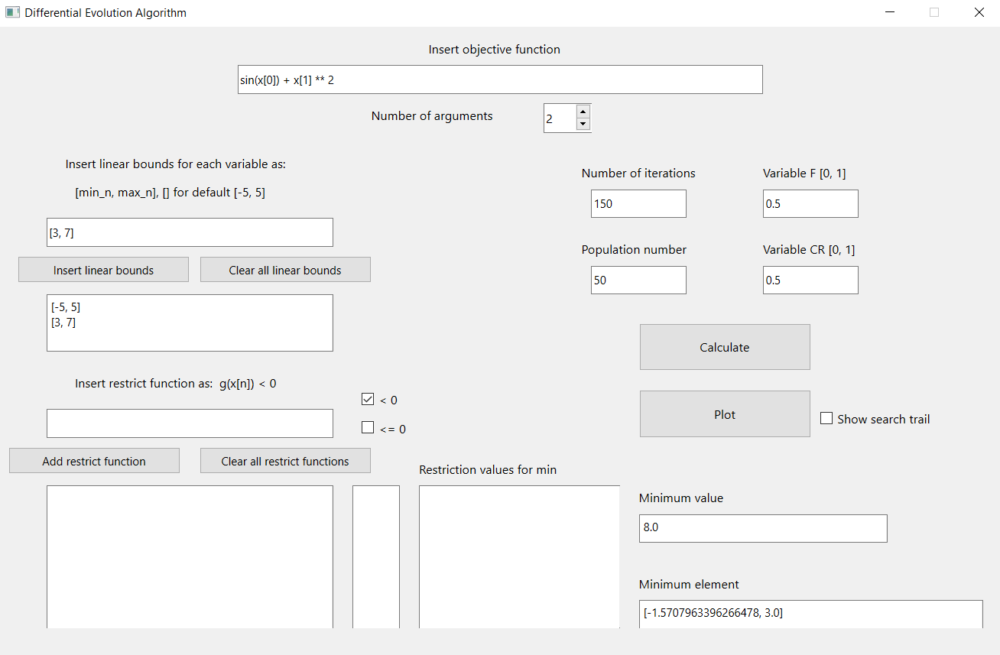

# Differential Evolution Algorithm
 
The application was created as university project.

## Table of contents
* [General info](#general-info)
* [Installation](#installation)
* [Future](#future)
* [Screens](#screens)
* [License](#license)

## General info

Application was created on Python language with use of PySide6 module and QTDesigner framework.
Through the interface application lets user input all necessary values for given problem. The algorithm calculates minimum of given objective function. It is possible for user to input constrain functions and plot 2d countour line or 3d cube, depending on number of arguments of objective function. With the checkbox user can display trail of found succeeding minimal values on a 2d countour. Every plot is displayed in a pop-up window.

## Installation

To run application you need to download only 2 files. 
The first is [ApplicationGUI](./ApplicationGUI.ui) responsible for the UI of app.
The second is [differential_evolution](./differential_evolution.exe) which launches program.

## Future

The application is far from perfect. We plan to improve things such as:
- add instructions on interface on how to input functions with use of sinus, pi, power etc.
- prevent user from inputting conflicting values.

## Screens

	

## License
This project is licensed under the terms of **the MIT license**.
You can check out the full license [here](./LICENSE)
